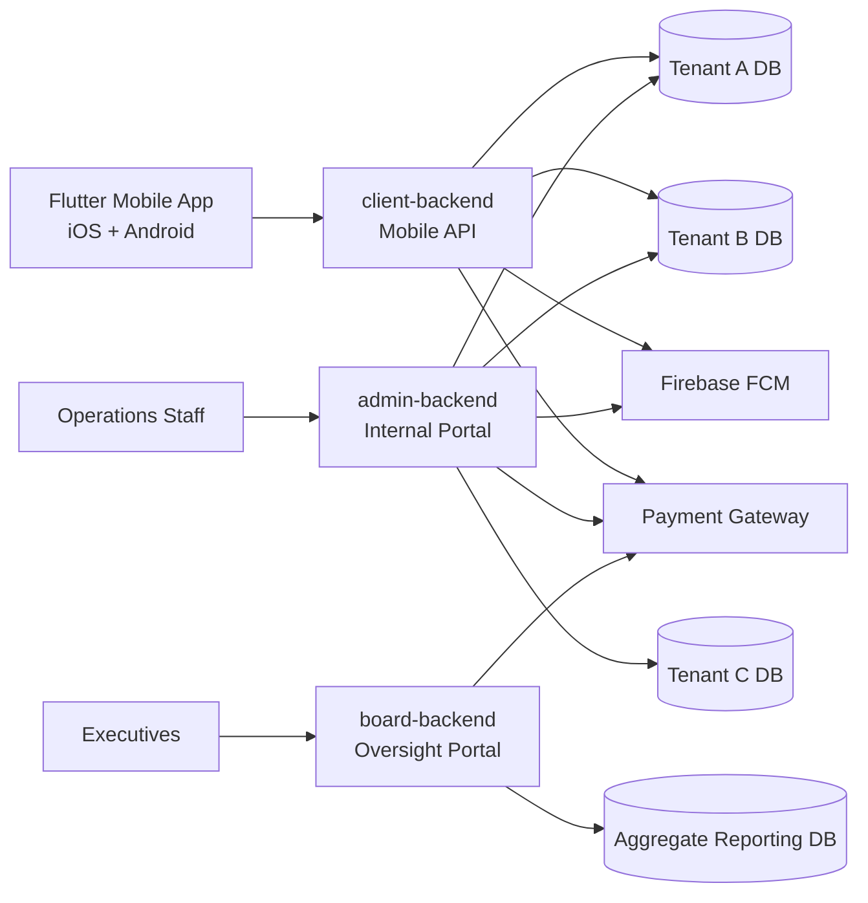

# AWMAS — Full-Stack Architecture Case Study

A public-facing technical showcase for a real production monorepo: **three Laravel backends** and **one Flutter mobile application**, wired together for a multi-tenant waste-management and environmental-services platform.

This repository is the **public, sanitized companion** to the production system. The source code for the four live applications is in private repositories. What is published here is a credible, code-level walkthrough of how the system is designed, how the pieces communicate, and how it is operated in real production conditions.

> Open the [live website](https://yusuf-kolayo.github.io/awmas-architecture/index.html) for the rendered version, or read the [architecture pages](#table-of-contents) directly in this repository.

---

## Production credentials at a glance

| Metric | Value |
| --- | --- |
| Companies running AWMAS in production | **11** |
| Flutter client downloads (App Store + Google Play) | **4,000+** |
| Minimum monthly transaction volume through the Flutter app | **₦25,000,000+** |
| Tenant databases under one codebase | **9+** |
| Coordinated applications in one workspace | **4** (3 Laravel + 1 Flutter) |
| Recurring GitHub Actions deployment pipeline | **Yes** (Laravel production deploy to VPS) |

AWMAS is not a prototype. It is the day-to-day operational backbone for waste-management and environmental-services companies across multiple Nigerian states — issuing real bills, processing real payments, and serving real customer accounts every day.

---

## Live mobile app

The Flutter client is published on both major stores. Employers can install it, log in with a demo tenant, and see the production UI in their own hands.

- **App Store** — [https://apps.apple.com/us/app/psp-hub-track-waste-bills/id6757864312](https://apps.apple.com/us/app/psp-hub-track-waste-bills/id6757864312)
- **Google Play** — [https://play.google.com/store/apps/details?id=com.ashraafitworld.psphub](https://play.google.com/store/apps/details?id=com.ashraafitworld.psphub)

---

## Table of contents

- [System architecture](#system-architecture)
- [Why this architecture](#why-this-architecture)
- [Documentation pages](#documentation-pages)
- [The four applications](#the-four-applications)
- [Representative engineering patterns](#representative-engineering-patterns)
- [Production-credentials details](#production-credentials-details)
- [Repository structure](#repository-structure)
- [Local development and serving the showcase](#local-development-and-serving-the-showcase)
- [Sanitization policy](#sanitization-policy)
- [About this showcase](#about-this-showcase)

---

## System architecture

AWMAS is organized as a **multi-application monorepo**. Each application has a distinct audience, a distinct data boundary, and a distinct set of workflows. They are not microservices that share a database — they are three independent Laravel applications that share a configuration-driven model for tenant routing.



### High-level request flow

| Request | Path | Data boundary |
| --- | --- | --- |
| Customer mobile app | Flutter app → `client-backend` | One of 9+ tenant DBs (resolved by request header) |
| Operations staff (CRUD, billing, payments) | Browser → `admin-backend` | Active LGA / tenant (resolved from session) |
| Executive / stakeholder reporting | Browser → `board-backend` | Aggregate reporting DB + cross-tenant rollups |

---

## Why this architecture

**1. Clear separation of responsibilities**

Operational, oversight, and mobile workflows do not share routes, controllers, or databases. The admin portal cannot accidentally expose a customer-facing endpoint. The mobile API cannot accidentally serve an internal staff view. Permission boundaries are structural, not enforced by middleware alone.

**2. Multi-tenant database routing at the connection level**

Each of the 11 production deployments points to its own database. Tenants are isolated at the **database connection level**, not at the query level. There is no shared `tenant_id` column that a developer could forget to filter by. The leakage risk is structural: a developer physically cannot query another tenant's data by accident.

**3. Service-layer domain logic**

Complex business rules — billing, payments, broadcasting, multi-channel notifications — live in dedicated service classes rather than being scattered across controllers. Controllers are thin. Domain logic is reusable. Rules are testable.

**4. Mobile-first defensive integration**

The Flutter client is not a thin wrapper. It handles tenant selection, multipart uploads, streamed binary PDF retrieval, JSON base64 fallback, push token acquisition with progressive backoff for iOS APNs, and WebView-based payment flows with deep-link reconciliation. The patterns shown in the [frontend page](frontend.html) are real, taken from the production codebase.

**5. Operational tooling that respects a monorepo**

Three Laravel services and a Flutter app in one workspace is convenient for coordination but introduces local-development friction. A single root-level bash script boots all three backends with distinct ports, binds the mobile API to the local network for physical-device testing, and traps Ctrl+C for clean shutdown. Editor settings explicitly point the Dart analyzer to the nested Flutter project. GitHub Actions deploys to the production VPS on every push to `main`.

---

## Documentation pages

This repository is rendered as a four-page public website. Each page covers one major concern of the system.

| Page | Focus | What's inside |
| --- | --- | --- |
| [System Overview](index.html) | What the system is, who uses it, what it does at scale | Hero, system-shape cards, request-flow diagram, representative-patterns grid, live store badges, screenshot grid, real client roster |
| [Backend Architecture](backend.html) | Laravel-side patterns worth highlighting | Tenant connection catalog, request-time database switching, multi-tenant login, service-layer domain logic, deferred activity logging, Process Authority approval workflow, immutable preserved billing, multi-format bill generation, internal cross-service PDF endpoint, bulk broadcast delivery |
| [Frontend Architecture](frontend.html) | Flutter-side patterns worth highlighting | Resilient bootstrap with FCM retry, platform-aware token retrieval, Riverpod state graph, runtime tenant context, unified request and upload handling, binary PDF download with progress and fallback, WebView payment flow, device fingerprinting, thin controllers / fat services |
| [Tooling & Operations](tooling.html) | How the system is run locally and in production | One-command multi-service boot script, editor configuration for a nested Flutter project, iOS debugging fallback, GitHub Actions deployment to VPS, real screenshots of the running services and editor |

> **Tip:** Open the pages in the order above. Each one builds on the previous, but each one also stands on its own.

---

## The four applications

### `admin-backend` — Operations

A session-aware Laravel application used by internal staff for day-to-day operations. Includes tenant-aware administration, billing and payment workflows, route-level permission management, and deferred audit logging.

**Highlighted patterns:**
- Multi-tenant database connection switching via `DB::purge()` + `DB::reconnect()`
- Deferred activity logging via `app()->terminating()` so audit overhead never blocks the user-facing request
- The **Process Authority** pattern — privileged actions are gated by an explicit permission slot; junior staff requests are parked in an **Admin Desk** inbox for senior approval, all from the same controller path
- Immutable **PreservedBilling** snapshots — every generated bill is snapshotted to a dedicated table with a content hash, so the printed document remains trustworthy even if the source data is later edited
- Multi-format bill generation — the same billing pipeline produces pre-printed overlays, fully generated documents, thermal receipts, and mobile softcopies
- Hierarchical route permission system with bulk operations, user-level overrides, and expiry support

### `board-backend` — Oversight

A Laravel application used by executives and stakeholders. Focused on cross-tenant reporting, deployment analytics, and governance dashboards. Isolated from operational CRUD to keep the reporting surface clean and the permission boundary obvious.

### `client-backend` — Mobile API

A Laravel application optimized for authenticated mobile requests. Provides tenant discovery, account workflows, payment initialization, document retrieval, and webhook endpoints. The Flutter client talks to this application exclusively.

**Highlighted patterns:**
- A shared-secret internal endpoint (`X-Internal-Secret`) that the client backend uses to request PDF rendering from the admin backend, switching tenant connections on the way in
- Forward-compatible response handling — the Flutter client can consume either streamed binary PDFs or JSON base64 envelopes from older deployments

### `client-frontend` — Flutter mobile app

A Flutter application for iOS and Android. Manages tenant context locally, brokers a complete payment-and-receipt flow, and supports 9+ tenant deployments from a single code line.

**Highlighted patterns:**
- Riverpod state graph — every long-lived piece of state is a typed provider; screens read with `ref.watch` and mutate with `ref.read(...notifier).state = ...`
- Tenant-aware request headers — the active business is stamped into request headers once, and individual calls never have to remember to attach the tenant key
- Platform-aware FCM token retrieval — iOS waits for APNs, Android invalidates stale Play Services tokens, both with progressive backoff
- Resilient PDF download with progress callbacks and JSON base64 fallback
- WebView-based payment flow with deep-link reconciliation — the user is never stuck on a payment screen

---

## Representative engineering patterns

| # | Pattern | Where it lives | Why it matters |
| --- | --- | --- | --- |
| 01 | Multi-tenant connection switching | `admin-backend` | Tenant isolation is structural, not enforced by query-level filters |
| 02 | Deferred activity logging | `admin-backend` | Audit overhead never blocks the user-facing request |
| 03 | Process Authority approval workflow | `admin-backend` | Privileged actions require an explicit permission slot; junior requests are parked for senior approval |
| 04 | Immutable preserved billing | `admin-backend` | Generated bills are cryptographically trustworthy even after source data changes |
| 05 | Multi-format bill generation | `admin-backend` | One pipeline produces overlays, complete documents, thermal receipts, and mobile softcopies |
| 06 | Internal cross-service PDF endpoint | `client-backend` + `admin-backend` | Shared-secret endpoint switches tenants and reuses the admin pipeline for rendering |
| 07 | Resilient app bootstrap with FCM retry | `client-frontend` | iOS APNs timing and Android Play Services stalls are handled inside the FCM layer |
| 08 | Platform-aware FCM token retrieval | `client-frontend` | The rest of the codebase never has to ask "what platform am I on" |
| 09 | Riverpod state graph | `client-frontend` | Single source of truth for every long-lived piece of state in the app |
| 10 | Runtime tenant context through shared headers | `client-frontend` | The active business is stamped into request headers once at connection selection |
| 11 | Unified request and upload handling | `client-frontend` | Pre-flight connectivity check, multipart upload, JSON POST — all through one method |
| 12 | Binary PDF download with progress and fallback | `client-frontend` | Older deployments keep working, newer deployments stream faster |
| 13 | WebView payment flow with deep-link reconciliation | `client-frontend` | The user is never stuck on a payment screen |
| 14 | One-command multi-service boot | repository root | One script replaces three separate terminals |
| 15 | Editor configuration for a nested Flutter project | `.vscode/` | The Dart analyzer stays enabled inside a Laravel-heavy workspace |
| 16 | GitHub Actions deployment to VPS | `.github/workflows/` | Production server state always matches the repository state |

---

## Production-credentials details

### Companies running AWMAS in production

The platform is the day-to-day operational backbone for these businesses:

- Nureni Saka Enterprises
- Labcleanings Waste Services
- Olamper Environmental Services
- Imperium Waste Services
- Favoreno Gobal Services
- Captalgee Ventures Limited
- Cuttysark Waste Limited
- Nasbebag Nigeria Limited
- Century Cleaners
- Precious Addy Nigeria Limited
- Olajendor Waste Services

Several of these companies use the Flutter mobile client to deliver bills and collect payments from their own customers — the same app that has accumulated 4,000+ downloads on the App Store and Google Play, and that processes a minimum of ₦25,000,000 in customer payments every month.

---

## Repository structure

```text
architecture-showcase/
├── README.md                   ← you are here
├── index.html                  ← System Overview page
├── backend.html                ← Backend Architecture page
├── frontend.html               ← Frontend Architecture page
├── tooling.html                ← Tooling & Operations page
├── css/
│   └── styles.css              ← Single shared design system
├── js/
│   └── app.js                  ← Theme toggle, sidebar, mobile menu
├── images/                     ← Screenshots and architecture diagrams
│   ├── admin-dashboard.png
│   ├── board-analytics.png
│   ├── flutter-app-screens.png
│   ├── system-architechture.jpeg
│   ├── editor-settings.png
│   └── running-services.png
└── serve-showcase.sh           ← Optional one-liner local preview server
```

The four HTML pages are a static site. There is no build step. Open `index.html` directly in a browser, or run the included bash script to serve the directory over HTTP.

---

## Local development and serving the showcase

### Option 1 — Open directly

The pages are fully self-contained. Double-click `index.html` in a file browser, or:

```bash
open index.html
```

### Option 2 — Serve over HTTP

Some browsers restrict certain features (like the Fetch API) when the page is opened from `file://`. To preview correctly:

```bash
./serve-showcase.sh
# Then open http://localhost:8000
```

Or, equivalently:

```bash
python3 -m http.server 8000
# Then open http://localhost:8000
```

The site uses:
- **Inter** (sans-serif body) and **Fira Code** (monospace code) from Google Fonts
- **highlight.js** for code syntax highlighting (loaded from CDN)
- **No build tools** — every page is valid HTML5, vanilla CSS, and vanilla JavaScript

### Theme toggle

Every page has a light/dark theme toggle in the top bar. The choice persists in `localStorage`.

---

## Sanitization policy

This public showcase keeps the architecture, the patterns, the engineering decisions, and the production-credentials signals intact, while removing anything sensitive.

**Removed from the public version:**
- Database credentials, API keys, and secret tokens
- Real tenant identifiers, real LGA / ward / street names, and real property addresses
- Real client phone numbers, email addresses, and contact details
- Real payment-gateway API keys and webhook secrets
- The production deployment URL for the mobile client
- The actual iOS bundle identifier
- The Cloudflare Turnstile site key
- Internal email addresses for staff notifications

**Kept in the public version (because they are the point of the showcase):**
- Real company names of the 11 production customers (with their consent)
- The 4,000+ download count from the App Store and Google Play
- The ₦25M+ minimum monthly transaction volume
- The number of tenant databases (9+) and the connection-catalog pattern
- All the engineering patterns — these are the value of the showcase
- The GitHub Actions deployment workflow — with secrets referenced as `${{ secrets.* }}` and the production path scrubbed to a generic `/var/www/awmas`
- The store listing URLs for the Flutter app — so employers can verify the production app themselves

---

## About this showcase

This folder is the public companion to four private repositories:

- `admin-backend` — Operational Laravel backend
- `board-backend` — Oversight Laravel backend
- `client-backend` — Mobile Laravel backend
- `client-frontend` — Flutter mobile application

The goal of this showcase is straightforward: **give employers a credible, code-level view of how I design, structure, and operate full-stack systems**, without exposing sensitive source code, credentials, or client-identifying business data.

If a hiring manager or engineering lead would like to discuss the live production system in more detail, the store listings, the deployment workflow, or any of the patterns documented here, the contact information is on my profile.

---

<div align="center">

**AWMAS architecture case study** · Public technical documentation · All names and metrics are real and verifiable.

</div>
