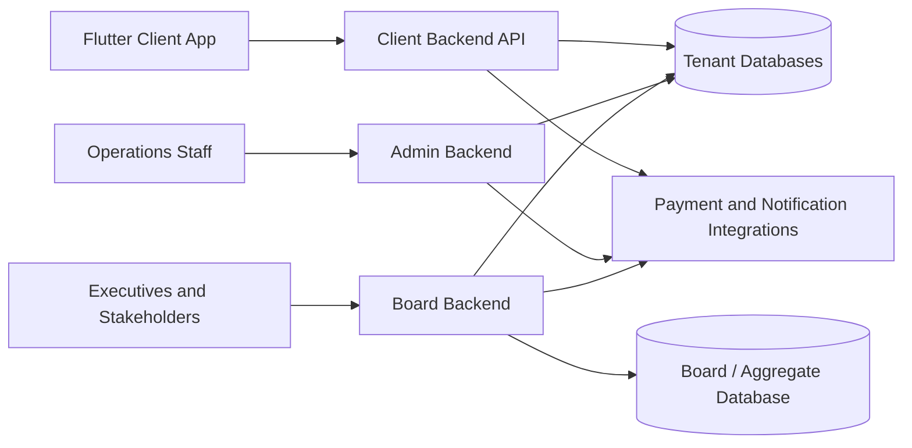

# AWMAS Full-Stack Architecture Showcase

This folder is a public-facing showcase plan and case study for a production-oriented monorepo that combines three Laravel backends with one Flutter mobile application.

The goal is simple: give employers a clear, credible view of how I design, structure, and operate full-stack systems without exposing sensitive source code, credentials, or client-specific business data.

## Showcase Purpose

This showcase is designed to demonstrate:

- system design for multi-application products
- Laravel architecture across multiple backends
- Flutter mobile architecture for real-world service delivery
- multi-tenant and multi-database thinking
- API design, mobile networking, and binary document delivery
- role-based access control and operational dashboards
- developer experience improvements for monorepo workflows

## System Summary

The source system is organized as four sub-projects under one parent workspace:

| Sub-project | Role in the system | Primary audience |
| --- | --- | --- |
| `admin-backend` | Operational backend for internal teams | Admin and operations staff |
| `board-backend` | Oversight and analytics backend | Executives and stakeholders |
| `client-backend` | Mobile/API backend for citizen or customer interactions | End users through the app |
| `client-frontend` | Flutter mobile application | Clients and residents |

## Architecture At A Glance

## Why This Architecture Matters

### 1. Clear separation of responsibilities
Instead of pushing every workflow into a single monolith, the system separates concerns into distinct applications:

- the admin backend handles operational workflows and staff actions
- the board backend focuses on oversight, reporting, and executive visibility
- the client backend provides a mobile-safe API surface
- the Flutter app focuses on user-facing flows such as sign-in, billing, statements, and payments

This separation improves clarity, reduces accidental coupling, and makes permission boundaries easier to reason about.

### 2. Tenant-aware database strategy
The client-facing backend is structured around multiple business or local-government deployments. Each deployment can point to its own database credentials through configuration and environment variables, allowing one application codebase to support multiple tenant datasets.

### 3. Role-specific internal portals
The system distinguishes between operational staff and oversight users. The admin portal includes middleware-driven route protection for different internal roles, while the board portal exposes a different reporting-oriented experience for executives and stakeholders.

### 4. Mobile-first API design
The Flutter app is not a toy frontend. It handles:

- connection discovery
- API authentication headers
- file uploads
- account statement PDF generation
- fallback handling for JSON and binary responses
- Firebase initialization and push notification token setup

### 5. Practical developer experience
The monorepo includes quality-of-life tooling for local development, such as a single script to boot multiple Laravel servers and editor configurations for opening the entire workspace while still debugging the nested Flutter application correctly.

## Notable Engineering Decisions

### Multi-backend Laravel organization
A major strength of this system is that Laravel is used in three different ways inside the same workspace:

- `admin-backend` behaves like an operations system with rich route groups, permissions, staff workflows, and session-aware context switching
- `board-backend` behaves like a reporting and governance system with role-specific dashboards and deployment analytics
- `client-backend` behaves like a mobile API optimized for authenticated requests, billing workflows, and document delivery

### Config-driven tenant catalog
The tenant configuration model is strong portfolio material because it shows architectural thinking rather than just controller CRUD. Tenant metadata, credentials, and connection names are centralized in configuration and surfaced to the app through services and environment values.

### Service-layer domain logic
The codebase includes meaningful service classes for account and billing workflows rather than pushing everything into controllers. That is the kind of maintainability signal many hiring managers look for.

### Mobile document delivery
The client app includes logic for downloading account statements even when the backend may return either JSON metadata or raw PDF content. That kind of defensive integration work is typical of production systems and worth highlighting.

## What Employers Should Review First

If you only have a few minutes, start here:

1. [backend-architecture/README.md](backend-architecture/README.md)
2. [backend-architecture/dynamic-database-routing.md](backend-architecture/dynamic-database-routing.md)
3. [backend-architecture/tenant-routing-code-sample.md](backend-architecture/tenant-routing-code-sample.md)
4. [backend-architecture/service-layer-patterns.md](backend-architecture/service-layer-patterns.md)
5. [frontend-architecture/README.md](frontend-architecture/README.md)
6. [frontend-architecture/api-integration-patterns.md](frontend-architecture/api-integration-patterns.md)
7. [frontend-architecture/app-bootstrap-and-state.md](frontend-architecture/app-bootstrap-and-state.md)
8. [frontend-architecture/network-and-mobile-runtime.md](frontend-architecture/network-and-mobile-runtime.md)
9. [devops-and-tooling/README.md](devops-and-tooling/README.md)

## Evidence Areas Covered In This Showcase

### Backend architecture
- multi-backend Laravel structure
- middleware-driven access control
- configuration-based tenant routing
- service-layer billing and account processing
- API rate limiting and request shaping
- sanitized code samples for tenant switching and domain logic

### Frontend architecture
- Flutter app bootstrapping and dependency initialization
- Riverpod-based application state patterns
- resilient networking and upload logic
- PDF and binary document handling
- mobile runtime considerations for iOS and device-based debugging
- sanitized code samples for API integration and app startup

### Tooling and operations
- monorepo-friendly editor setup
- local multi-service boot process
- physical device testing workflow
- practical debugging setup for Flutter in a parent-folder workspace

## Screenshot Placeholders

Use the following placeholders when preparing the final employer-facing version:

- `assets/admin-dashboard-overview.png`
  Caption: "Admin operations dashboard showing the internal control surface for staff workflows."
- `assets/board-dashboard-analytics.png`
  Caption: "Board analytics dashboard focused on cross-business visibility and executive reporting."
- `assets/mobile-home-screen.png`
  Caption: "Flutter mobile home screen showing the client-facing experience."
- `assets/mobile-billing-screen.png`
  Caption: "Flutter billing or statement screen demonstrating end-user financial workflows."
- `assets/system-architecture-diagram.png`
  Caption: "High-level architecture diagram for the full Laravel and Flutter system."

## Sanitization Policy

The public version of this showcase should keep the architecture intact while removing anything sensitive.

That means:

- replace real tenant or client names with generic identifiers such as `Tenant A` and `Tenant B`
- remove secrets, tokens, passwords, and internal URLs
- avoid publishing live operational metrics
- keep screenshots blurred or redacted where necessary
- explain the decision-making and patterns, not the confidential business details

## Recommended Next Additions

This documentation layer is now in place. The next high-value additions are:

1. one or two simplified architecture diagrams
2. real screenshots dropped into the `assets` folder using the placeholder filenames
3. a short portfolio landing page or separate public repository that links to this showcase
4. optional short case-study pages focused on outcomes, trade-offs, and lessons learned
